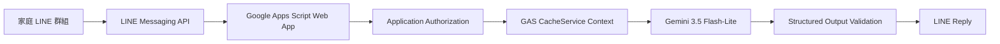

# LINE 印尼文家庭照護 AI 翻譯 Bot

這是一個為我的爸爸與家中印尼籍看護設計的 LINE AI 翻譯 Bot。

日常照護溝通經常需要在繁體中文與印尼文之間切換。原本每次都要複製訊息、開啟 Google 翻譯、貼上文字，再把結果複製回 LINE，不但操作繁瑣，單句翻譯也可能因缺少對話背景而誤判稱呼、代名詞或省略的主詞。

因此，我將 LINE Messaging API 與 Gemini AI 串接。家人與看護只需要像平常一樣在家庭 LINE 群組傳送訊息，Bot 就會自動判斷語言、決定翻譯方向，並將結果直接回覆到群組。

Bot 也會參考同一個家庭 conversation 最近的短期上下文，協助 AI 理解稱呼、代名詞與省略主詞，讓翻譯更符合家庭照護的實際對話情境。

> 這不只是一個翻譯工具，而是希望降低家人與外籍看護之間的溝通成本，讓重要的日常照護資訊可以更直接地被理解。

## 使用方式

- 家人傳送繁體中文，Bot 自動翻譯成印尼文。
- 看護傳送印尼文，Bot 自動翻譯成繁體中文。
- 支援少量英文及中／印／英混合語句。
- 不需要離開 LINE。
- 不需要手動選擇翻譯方向。
- 不需要再將訊息複製到 Google 翻譯。

### 對話範例

家人在 LINE 群組傳送：

> 阿嬤今天下午三點要吃藥。

Bot 自動回覆：

> 🇮🇩：Nenek harus minum obat hari ini pukul tiga sore.

印尼籍看護傳送：

> Nenek sudah makan dan minum obat.

Bot 自動回覆：

> 🇹🇼：阿嬤已經吃飯和吃藥了。

## 為什麼使用 AI 與上下文？

家庭照護對話經常省略人物、物品或動作，例如：

- 「她剛剛吃過了。」
- 「下午三點再給她。」
- 「那個放在桌上。」
- `Sudah diminum.`

一般單句翻譯只能看到當下輸入的文字。這個 Bot 會把目前訊息與相同 conversation 最近的匿名短期 Context 一起提供給 Gemini，協助判斷「她」、「那個」或省略主詞所指的對象。

Context 只用於改善當下翻譯：

- 最多保留最近 20 則成功處理的原始訊息。
- 約一小時沒有新訊息後失效。
- 不使用 Google Sheets、Firebase 或永久資料庫。
- 不提供聊天紀錄查詢。
- 不永久保存家庭對話。

## Demo

<!-- 建議在此放置一張已遮蔽姓名、頭像、群組名稱與時間的 LINE 對話截圖。 -->

## 核心功能

- 繁體中文與印尼文自動雙向翻譯。
- 自動判斷來源語言與目標語言。
- 使用 Gemini AI 產生翻譯。
- 使用短期上下文改善代名詞與省略句判斷。
- 保留人名、藥名、劑量、日期、時間與重要照護數值。
- 只允許指定家庭群組及管理者私訊使用。
- 非文字訊息與未授權來源靜默忽略。
- Gemini 與 LINE reply 成功後才更新 Context。
- 翻譯成功但 LINE reply 失敗時不寫入 Context。

## 系統架構



Google Apps Script 是唯一應用執行環境，不需要自架 Cloud Run、Cloud Functions、Proxy Server 或資料庫。

## AI Translation

本專案使用 Google Gemini API 作為 AI 翻譯核心。

目前實際設定與 integration test 使用的模型為：

```text
gemini-3.5-flash-lite
```

模型名稱不寫死在 production code，而是透過 GAS Script Property 設定：

```text
GEMINI_MODEL=gemini-3.5-flash-lite
```

API key 同樣只保存在 Script Properties：

```text
GEMINI_API_KEY
```

Repository 不包含正式 API key。

### Structured Output

Gemini 必須依指定 schema 回傳：

```json
{
  "sourceLanguage": "zh-TW",
  "targetLanguage": "id",
  "translatedText": "Nenek harus minum obat pukul tiga sore."
}
```

正式程式會驗證：

- Provider response 是否為合法 JSON。
- 必要欄位是否存在。
- 是否包含不允許的額外欄位。
- 目標語言是否為 `zh-TW` 或 `id`。
- 譯文是否為非空白字串。
- AI 是否擅自在譯文中加入顯示用國旗 prefix。

只有通過正式 parser 與 validator 的結果才會回覆到 LINE。

## Translation Flow

1. 接收 LINE webhook event。
2. 驗證 payload 與 event 基本結構。
3. 使用 `ALLOWED_GROUP_ID`／`ADMIN_USER_ID` 執行 application authorization。
4. 讀取相同 conversation 的匿名短期 Context。
5. 將 Context 與目前訊息交給 Gemini。
6. 驗證 structured output 並格式化翻譯結果。
7. 透過 LINE reply API 回覆一次。
8. 端到端成功後才將使用者原始訊息加入 Context。

## Privacy and Security

- Credentials 與 private identifiers 只存於 GAS Script Properties。
- Repository 不包含 API keys、LINE tokens、groupId、userId 或正式聊天內容。
- Context key 使用 source namespace 與 identifier 的 SHA-256 digest。
- Gemini-facing history 只包含匿名 `{speaker, text}`。
- 不保存 Bot 譯文、reply token、display name 或 provider response。
- 未授權來源不呼叫 Gemini、不回覆 LINE、不讀寫 Context。
- Cache miss、提前淘汰或資料損壞會安全退化為空 Context。

### Webhook authenticity limitation

第一版維持純 Google Apps Script Web App。標準 `doPost(e)` 無法可靠取得 LINE 的 `X-Line-Signature` request header，因此目前不實作、也不宣稱具備 LINE 官方標準 webhook signature verification。

`ALLOWED_GROUP_ID` 與 `ADMIN_USER_ID` 只屬於 application-level authorization，不能證明 HTTP request 確實由 LINE 傳送，也不能取代 transport authenticity verification。

## Tech Stack

- LINE Messaging API
- Google Apps Script
- Gemini API
- GAS CacheService
- JavaScript
- clasp

## Verification

- 本機 mock／regression tests：196 assertions passed。
- 全部 `src/*.js` 通過 syntax check。
- Gemini production request path 已在 GAS 人工 integration test 驗證。
- GAS Script Cache production path 已在 GAS 人工 integration test 驗證。
- LINE Developers Webhook Verify 已實測通過。

人工 integration test 不會由 `doPost()`、LINE event 或一般 regression runner 自動執行。

## Project Structure

```text
src/
├─ appsscript.json
├─ Code.js
├─ Config.js
├─ LineService.js
├─ TranslationService.js
├─ ContextService.js
├─ AiService.js
└─ DevelopmentTest.js

docs/
├─ PROJECT_OVERVIEW.md
├─ ARCHITECTURE.md
├─ SETUP.md
├─ DEVELOPMENT_WORKFLOW.md
└─ specs/
   ├─ 01-line-message-flow.md
   ├─ 02-ai-translation.md
   ├─ 03-context-cache.md
   └─ 04-error-handling-security.md
```

## Setup

完整步驟請參考 [docs/SETUP.md](docs/SETUP.md)。

必要 GAS Script Properties：

```text
LINE_CHANNEL_ACCESS_TOKEN
LINE_CHANNEL_SECRET
GEMINI_API_KEY
GEMINI_MODEL
ALLOWED_GROUP_ID
ADMIN_USER_ID
```

請勿將 property values 寫入 source、文件、issue、截圖或 log。

## Disclaimer

本專案只進行忠實翻譯，不提供醫療建議。使用者仍應自行確認藥名、劑量、時間與其他重要照護資訊。

